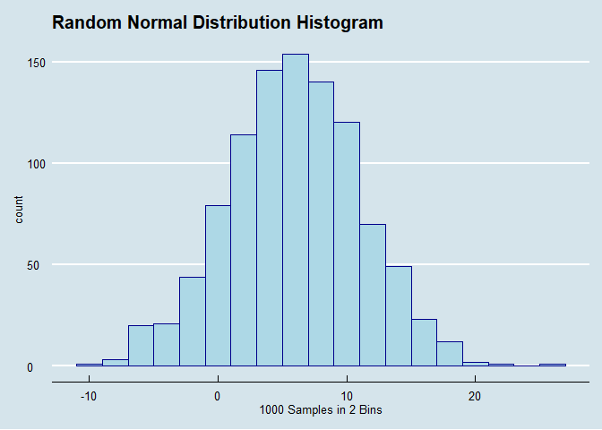

<!-- README.md is generated from README.Rmd. Please edit that file -->

# rsdistplot

<!-- badges: start -->

<!-- badges: end -->

The goal of rsdistplot is to allow users to generate random samples
(rsdist) and plots of histograms (rshist) for the random samples of 4
different distributions: Normal(“n”), t(“t”), F(“f”), Binomial(“b”).

## Installation

You can install the released version of rsdistplot from
[CRAN](https://CRAN.R-project.org) with:

``` r
install.packages("rsdistplot")
```

## Example

This is a basic example which shows you how to solve a common problem:

rsdist(“n”, n = 1000, x = 6, y = 5, s = 1)

rsdist(“n”, n = 1000, x = 6, y = 5, s = 1, b = 2)

``` r
library(rsdistplot)
## basic example code
```

What is special about using `README.Rmd` instead of just `README.md`?
You can include R chunks like so:

``` r
rsdist("n", n = 1000, x = 6, y = 5, s = 1)
#>    [1]  2.867730946  6.918216621  1.821856938 13.976404011  7.647538859
#>    [6]  1.897658079  8.437145262  9.691623526  8.878906758  4.473058064
#>   [11] 13.558905842  7.949216182  2.893797097 -5.073499436 11.624654591
#>   [16]  5.775331955  5.919048685 10.719181053 10.106105975  8.969506606
#>   [21] 10.594886858  9.910681504  6.372824917 -3.946758479  9.099128739
#>   [26]  5.719356302  5.221022466 -1.353761919  3.609249724  8.089707801
#>   [31] 12.793397758  5.486061363  7.938358058  5.730974797 -0.885297784
#>   [36]  3.925027184  4.028550231  5.703433016 11.500126860  9.815878742
#>   [41]  5.177382019  4.733191599  9.484816877  8.783315993  2.556221527
#>   [46]  2.462524215  7.822909811  9.842664623  5.438268939 10.405538632
#>   [51]  7.990529402  2.939868034  7.705598457  0.353184520 13.165118509
#>   [56] 15.901999493  4.163892618  0.779326868  8.848598137  5.324726981
#>   [61] 18.008088803  5.803799986  9.448696812  6.140010794  2.283633956
#>   [66]  6.943961498 -3.024793144 13.327774308  6.766266691 16.863058352
#>   [71]  8.377547644  2.450267845  9.053631767  1.329511842 -0.268167001
#>   [76]  7.457231178  3.783540634  6.005526758  6.371706621  3.052395269
#>   [81]  3.156656336  5.324106924 11.890434983 -1.617834002  8.969730938
#>   [86]  7.664751856 11.315499186  4.479080382  7.850094050  7.335493954
#>   [91]  3.287399845 12.039339030 11.802013078  9.501068248 13.934167273
#>   [96]  8.792432128 -0.382961042  3.133672929 -0.123063074  3.632996818
#>  [101]  2.898166614  6.210579366  1.445391757  6.790143862  2.727076780
#>  [106] 14.836436347  9.583537380 10.550871147  7.920926789 14.410880403
#>  [111]  2.821317730  3.691776348 13.161411193  2.746518233  4.963096282
#>  [116]  4.035960353  4.400035657  4.604433485  8.470941656  5.113347589
#>  [121]  3.470212689 12.715194126  4.927102957  5.102217350  5.499046294
#>  [126]  9.563331535  5.632177979  5.811829143  2.591697606  4.378648639
#>  [131]  6.300802202  3.055527569  8.657480963 -1.591970409  7.532789304
#>  [136] -1.682249118  4.495119366  3.358600478  2.739526097  5.715516111
#>  [141] -3.571797128 11.882916560 -2.324862181  3.682347993  0.420399475
#>  [146]  2.245904994 16.435832728  6.086978098 -0.431502652 -2.203027672
#>  [151]  8.250935506  5.907200836  4.409658127  1.353189263 -1.437301551
#>  [156]  0.624038517 11.000144019  2.893666526 -0.922134237 15.346453112
#>  [161]  8.125501887  4.806764495 11.292415244 10.432113257  2.903784759
#>  [166] 17.030512323  4.724864849 -1.122473251  5.278001990  7.037691696
#>  [171] 17.539891995  6.529011839  8.284994027  5.614235323  4.329995788
#>  [176]  5.826369858  9.938198028 16.376225043 11.136962194 12.039541992
#>  [181] -0.156617108 10.919477850  7.099624018 -1.336250145  8.605113713
#>  [186]  5.206226976 13.322936560  2.169590002  3.848941230  1.369452513
#>  [191]  5.114480193  8.010058897  2.341259134 10.151865840 -0.040413932
#>  [196]  0.760077936 13.205788534  0.920762673  8.059873562  4.094619744
#>  [201]  8.047009198 14.444366431 13.932942167  4.345460997 -5.426177676
#>  [206] 18.488307949  9.335330834  8.706636680  5.933002384  8.550542115
#>  [211]  5.178120841  8.103473216  3.998766280 -0.851039388 10.939191337
#>  [216] 13.598725127  4.456297154 -0.266448778  9.211206528  5.776454316
#>  [221] -2.666092034  6.010659298  2.848498330  4.295157101  0.217138187
#>  [226] 15.015709540  4.344339818 -2.027567061  6.985967194  7.315878232
#>  [231]  1.070866498 -8.444603358  2.797591487  8.852538180  5.701383620
#>  [236]  5.509106280  8.804103643  0.067706807 11.483885221  5.973279859
#>  [241]  9.536553337 11.170538674  7.117402075  1.606461936 11.814822780
#>  [246] -4.000824724  3.276046300  4.721646454  5.169394816 11.102319544
#>  [251]  6.681109466  8.035838017  5.651725935  4.761678292  9.477754033
#>  [256] 11.731141786 -6.015481074  8.863697776  7.873622034  3.873661392
#>  [261] 10.755064038  4.053814091  4.578346691 10.287048890 14.598136496
#>  [266]  7.350274505  3.889079951  0.054433526  4.344835106  1.300853367
#>  [271]  4.705337084  7.971895841  1.740714540 19.245834405  6.780058378
#>  [276] 11.651036337 -5.445619899  9.705005786 -0.581225802 10.599018388
#>  [281]  7.990650777  3.962357104 12.621293151  2.493841654  3.096928479
#>  [286]  0.994639095  2.659106966 10.725924767  8.168510748 11.025796088
#>  [291]  4.049406680  7.881851459  7.220824622 -1.131286712 14.892146437
#>  [296]  6.672238305  9.827994996 10.775683385  5.747171493  4.470922901
#>  [301] 10.468368512  0.763509255 15.856686931  4.081839469 14.270726511
#>  [306] 13.561063470  6.414828668  8.836104574  0.877257602  7.615032515
#>  [311] 11.218062292  6.495392434  3.729315454  2.721090738  5.820387887
#>  [316] 11.345807303  3.580125348  5.394949443 -0.470700019  8.471564180
#>  [321] 12.539507601 13.485205047 10.073513654 -3.348943951  8.410147521
#>  [326]  8.280678017  4.232998571  6.852447355  1.679820229  9.396153870
#>  [331]  4.364494927 -1.845410926  4.162746219 12.822174645  4.328593176
#>  [336]  9.663750211 10.732928201  6.021993522  4.238388472  3.351522454
#>  [341]  9.697946128  0.682712923  7.231054218  4.552503167 -5.324446782
#>  [346] -1.044252280 10.580096644  5.043605247 10.016416081 15.437372317
#>  [351] 13.369405906  9.386342462  7.899813433  5.036007868 13.889458975
#>  [356]  8.981170547  0.132115296  5.221787326 -3.594549101  5.023705769
#>  [361] -6.961638350 12.570010836  2.822284995  3.850105807  5.153408338
#>  [366]  9.061090870  9.391700886  8.839759862  3.137286980 -0.816456281
#>  [371]  4.056388778  7.389570662  1.884594392  5.655795328  0.161688369
#>  [376]  5.958454929  6.644277008  5.270621858  5.180445216 14.817760014
#>  [381]  9.812932562 11.557155404  1.383965236  6.821709192 11.774125935
#>  [386]  5.717392877 -4.646803241  7.724228810 -3.524777228  1.944149234
#>  [391] 12.620021606  9.078184247 11.458344778  7.533024308  5.449206188
#>  [396]  1.378436134 13.964568769  6.225052991  2.424357997 10.326115499
#>  [401] 11.372204791 15.478273871  2.985013482  4.045660896  3.918889842
#>  [406]  4.121712886  4.166845271  4.521612736 13.209102051  2.512308540
#>  [411]  4.059162470  9.262682261 11.623862233  2.139445985  3.459568919
#>  [416]  8.618102952 11.088771133  4.744177060 -1.149967237 14.545605161
#>  [421] 13.175347862  2.448144271  5.674662132 -2.797343677  8.848614859
#>  [426] 14.061733991 -2.186403236  2.102157434  2.794115331  2.594343032
#>  [431] -4.166427978  8.504817796 -1.658990700  5.875011804  8.964923605
#>  [436]  5.009022893 10.460041962  5.871424645  2.761697747  9.231797075
#>  [441]  3.830836300 14.863055925  5.908701444 10.264074968  7.025814516
#>  [446] -9.040242995 -0.830559657  3.879488699  7.184018319 -5.713615602
#>  [451] 10.808483167  2.977871331  2.235613603 -1.778057963 -1.269468690
#>  [456]  6.281659180  8.546847033 -4.489414799  0.978190103  8.678858611
#>  [461]  3.734814577 16.826842509 12.228733364  8.977490170  6.024422248
#>  [466]  7.396803910  2.470469374  9.140085765 13.401069800 11.417149550
#>  [471]  1.933778717 -2.094384246  5.451721503  8.204446855 12.754969899
#>  [476] -0.593047423  7.821922963  7.167499175 11.969776306  5.860450139
#>  [481]  4.213505727  0.265929319  3.412897582  4.189381137 17.752771629
#>  [486] 18.232656878  5.166483603  0.781662805 -3.864674670  8.573358167
#>  [491]  0.547132081 17.423296628  1.571912137  6.555532149 25.051383404
#>  [496]  0.455450010  7.537833122  0.465527639  7.738268244  1.633677325
#>  [501]  6.386515614  4.515656789  0.083788798  6.056463442 10.958005180
#>  [506] 13.969837270 -0.863556355  4.751945335 11.797122634  0.428888261
#>  [511] -6.642503444  1.320487207  1.163802710  6.237442962  3.981316033
#>  [516]  7.157480641  3.888137960  7.870591973  4.169971125 11.950507233
#>  [521]  2.313362374  7.453333227  1.575752159  7.040032394  5.761349138
#>  [526] -2.422603231  5.278867217 11.901068328  9.406999616  6.716238154
#>  [531]  0.038417781 11.846143264  6.396008545  3.741131236 14.210141064
#>  [536]  2.152038392  7.516804804 12.408687106  9.011113976  4.464888677
#>  [541]  3.907909483  7.775677650  8.567405573  6.093037002 12.592244861
#>  [546]  5.670840001  2.498519608  8.686630658 -5.008911612  7.959868719
#>  [551]  8.484804762  4.875626423  0.414284173  4.025026983 13.749151711
#>  [556]  2.282427601 -5.658560589 10.061227211  3.493446714  3.445567170
#>  [561] -0.076820206  5.887206858  9.506196502  3.062589872  2.966360293
#>  [566] 11.483201075  4.762451615  5.200491433  2.871108746 10.502173178
#>  [571]  1.029031854 10.246251929 10.028511445  3.661995320 10.242101569
#>  [576] 10.933849318  8.878101443 16.124210227 -3.811765956  0.175395347
#>  [581] -0.882596069  6.838399672 13.923145396 14.389444765  8.441483492
#>  [586] 10.393366313  5.275625630  8.344858800  7.881177386  2.194798625
#>  [591]  4.533525331  5.325793678 12.969229081  0.815056552 -4.571675739
#>  [596]  9.841391091  1.919196896  3.819465384 10.523525156  2.184568677
#>  [601]  4.294665102 13.512122671  8.641538562  8.710956777  5.316633221
#>  [606]  0.316330733 -1.483135772  4.883071782 16.008596139  7.108519081
#>  [611]  6.821864546  7.663118044  4.073960005 -0.993770133 19.378703979
#>  [616]  3.881569557  4.506992440 -2.961708634  4.759958875  4.763480408
#>  [621]  4.722448107 -2.934690500 14.923314080 14.817931739  9.448001110
#>  [626]  0.496296778  9.572546784  4.767648415  4.401069170 12.813221465
#>  [631] -0.139412950  3.443903836  2.344025005  6.098760034 -1.864319574
#>  [636]  2.483333651  9.579660445  8.326074532  1.130488468  8.796088652
#>  [641] -6.163198727  4.297575366  9.565165974  2.704813068  5.817986887
#>  [646] -1.966431508 10.238963986 -3.251944243  4.381746842  4.723759437
#>  [651]  6.304606137  1.882541855 15.148652424 -1.149581079  7.270685715
#>  [656] -8.698868477  6.012079045  8.548327856  0.576399994  9.524164884
#>  [661]  7.654881750 10.881637365  1.783300598  1.147100476 -2.857656743
#>  [666]  4.387648292 -0.694003712  9.440780141  6.356403261 16.948761796
#>  [671]  0.211462003 11.908440320  3.363158192 -1.283140057  8.864836852
#>  [676] -1.166888523  0.724074907  2.334440613  7.054536321  1.005396365
#>  [681] 11.389251616  0.005128087  7.083185176  6.715435149  0.671249545
#>  [686]  3.856882946  2.719102616 10.796971634 13.780263181  0.796017831
#>  [691] 10.652862043  5.622770345 -3.835976745  2.220481787  8.305745803
#>  [696]  6.725533155 -6.211556605  8.901593427  9.275259992  4.477455814
#>  [701]  2.462158837 15.857860072  5.550006597  5.929913740  0.382715314
#>  [706] -0.720650617 -1.615778855  3.890158948 12.804622320 14.768974227
#>  [711] 13.841823672 12.483777850  4.812018743 -0.120750678  4.360936599
#>  [716] -6.062251381  4.431035633 14.299393523  6.654765503 11.479443413
#>  [721]  8.446704785  2.105448523 14.717796765  5.608063573  1.122231037
#>  [726]  6.353299124 -1.592997644 10.318895164  8.507841927  4.226093352
#>  [731]  3.557855562 10.681469736  0.687958068  1.080895641  8.121239385
#>  [736]  3.743432597 10.625423984  5.006895951 11.974255085  8.477723526
#>  [741] -5.225762870 -0.676856802 12.413876031  9.453979521  1.164686661
#>  [746] -0.728968425 11.168326947  1.941117702 15.008627393 14.857709802
#>  [751] -1.273456849  1.771728437 -0.252398297  9.336440340 -0.453848438
#>  [756] -4.175017692 16.106734972 11.029867438 10.085618006  2.680058582
#>  [761]  5.943593844  9.098386281 -0.406193710  5.378693368  6.878708273
#>  [766] 14.463868972  9.210663586 12.411165162  6.702734868  0.437486584
#>  [771]  4.301615140 -2.323823196 10.644258809 13.084134174  5.686396112
#>  [776]  1.095488320 11.435751256  6.696635133  4.068639512 11.617927116
#>  [781]  2.200771713 11.744795516  1.787618705  7.957066702 10.456886212
#>  [786] -0.676293563  7.990617389  5.442065985  9.378719583  2.057010323
#>  [791]  5.565068330 12.911420039  6.842450819 10.115954741  4.895527012
#>  [796]  0.853041726  5.945371546 -0.124955777 -6.980556942 11.845612960
#>  [801]  0.565455915 -3.130415063 10.976409036  5.940691093  3.001858026
#>  [806]  5.110260067  3.870093291 10.983293882  9.638303543 -2.633152979
#>  [811]  7.766992478  9.634068329  9.341304880 -6.121586546  4.823212875
#>  [816] 15.898166605  9.983972693 -2.546380903 -2.318343559  8.455547762
#>  [821]  5.129722572 10.806452819  7.469133308  6.404996818  6.918309214
#>  [826]  6.831275177 -0.347995331 17.747466603 -1.060027037  5.915192536
#>  [831]  3.278403237 15.000561667 11.057200881  3.181417220  7.027103977
#>  [836] 11.827309751 17.181614198  7.511325381  0.787466989  1.082288433
#>  [841] 16.028592902 -4.352857419 21.278711844  4.693247030  3.728033704
#>  [846]  6.787802777 10.666943639  7.514141379 -3.780751112  7.767683547
#>  [851]  8.252122569  9.297754353  0.842896362 -5.855114407  4.377118461
#>  [856]  1.278506245  2.170550008  1.231103666  4.009977751  4.443914685
#>  [861]  9.980463566 10.932141719  2.027341688  4.455910142  7.807223830
#>  [866] 12.993955524  5.719647902 -2.494367458  7.159262726  5.404546645
#>  [871] 14.862464267  7.717110827  2.884751088  3.802388531  3.473516052
#>  [876]  6.930175686  6.882088988 10.579241034  7.600883631  4.166563514
#>  [881]  1.296943524  9.173514657  5.687557588  6.914189338 11.518205092
#>  [886] 14.760178093  1.230917699 14.220402284  1.666332353  7.331760961
#>  [891]  7.111852474  4.615457451 12.971265205  2.705440001  9.302656403
#>  [896]  5.933721499  1.342598506 12.073445717 -4.441701828  3.369237653
#>  [901] -1.707012835  6.971605350  7.322112747  0.406324156  9.254764781
#>  [906]  0.835498807  9.296007497  7.189146998  9.576379736  1.307584804
#>  [911]  6.476770048  3.685902900 -1.344410780  6.763432528 14.868813057
#>  [916]  2.759645332  5.000912622  9.446218665  6.180727549 15.717681561
#>  [921]  9.686068669 17.606669665  7.744546731  0.330416694  8.106676340
#>  [926]  1.377218716  0.964688169  5.052628349 10.669583501  7.719549998
#>  [931] 10.070101382 10.576705011  5.140739348 -6.011155568  9.979534259
#>  [936] 16.845579347  6.291917497 -0.774572248  4.162246172  1.327412104
#>  [941]  5.791803900  9.380560028 10.332180734  7.175875124  1.330149334
#>  [946] 10.066260836 12.741592776 17.259413880  3.531737828  8.370462996
#>  [951] 11.968458331  5.418022642  8.624292779  7.072107406  5.327752327
#>  [956]  6.842545514 10.823663848  8.043894570  3.667808924 -5.198914879
#>  [961]  2.024684074  5.900224413 -6.572125610 17.054760158 -1.443811150
#>  [966]  0.196240622 13.288691125 -4.949379744  9.695313406  4.279956157
#>  [971]  8.279383708 10.390551313  1.207680385  2.470775771 -8.984746516
#>  [976]  1.194738380  7.900941270  8.525337948 16.135280019  6.323135144
#>  [981]  8.318293242  6.373891663  3.565818821  9.744554104  8.321172904
#>  [986]  6.647102292  1.922696742  5.799247741  9.907084888  9.382263737
#>  [991]  3.586737372  2.654432660  8.564006610 11.244549645  6.605290816
#>  [996]  4.433535573  1.596646350  3.903565544 -1.413758390  2.513409003
```



You’ll still need to render `README.Rmd` regularly, to keep `README.md`
up-to-date.

In that case, don’t forget to commit and push the resulting figure
files, so they display on GitHub\!
