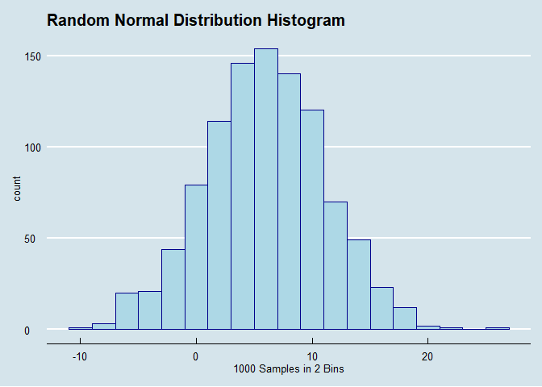

<!-- README.md is generated from README.Rmd. Please edit that file -->

# rsdistplot

<!-- badges: start -->

<!-- badges: end -->

The goal of rsdistplot is to allow users to generate random samples
(rsdist) and plots of histograms (rshist) for the random samples of 4
different distributions: Normal(“n”), t(“t”), F(“f”), Binomial(“b”).

## Installation

You can install the released version of rsdistplot from
[CRAN](https://CRAN.R-project.org) with:

``` r
install.packages("rsdistplot")
```

## Example

This is a basic example which shows you how to solve a common problem:

rsdist(“n”, n = 1000, x = 6, y = 5, s = 1)

rsdist(“n”, n = 1000, x = 6, y = 5, s = 1, b = 2)

``` r
library(rsdistplot)
library(tidyverse)
```

``` r
rsdist("n", n = 1000, x = 6, y = 5, s = 1) %>% head(20)
#>  [1]  2.867731  6.918217  1.821857 13.976404  7.647539  1.897658  8.437145
#>  [8]  9.691624  8.878907  4.473058 13.558906  7.949216  2.893797 -5.073499
#> [15] 11.624655  5.775332  5.919049 10.719181 10.106106  8.969507
```

``` r
rshist("n", n = 1000, x = 6, y = 5, s = 1)
```



You’ll still need to render `README.Rmd` regularly, to keep `README.md`
up-to-date.

In that case, don’t forget to commit and push the resulting figure
files, so they display on GitHub\!
